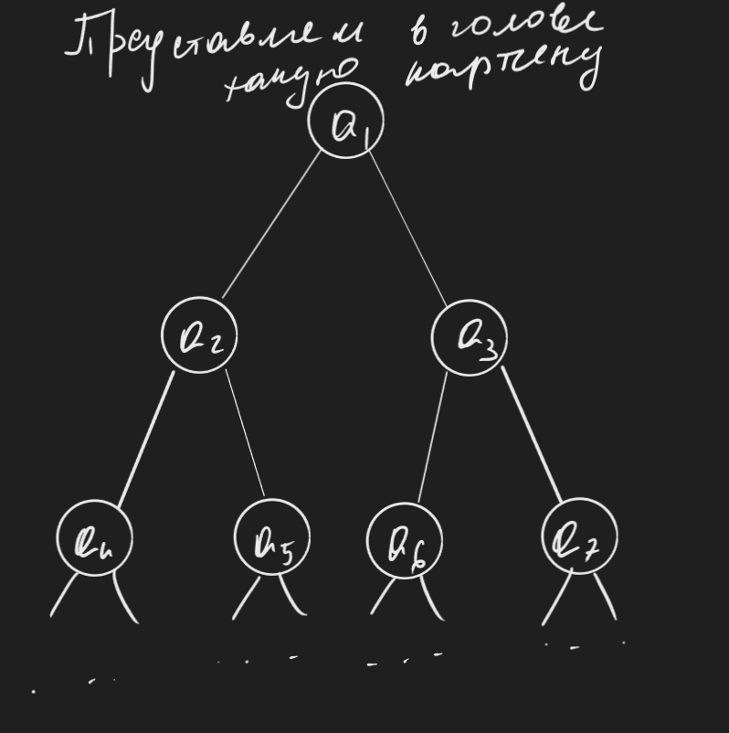
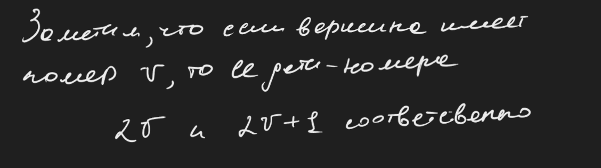
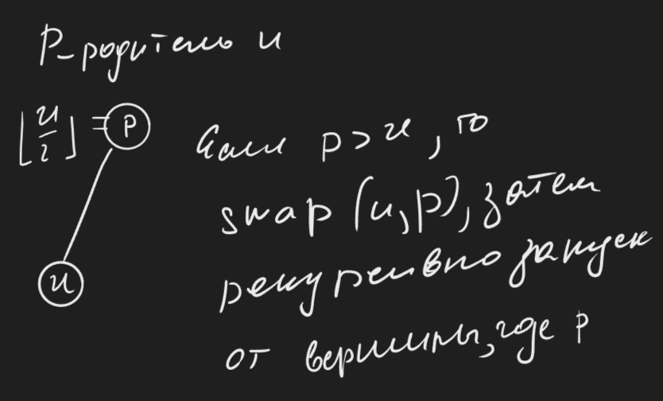
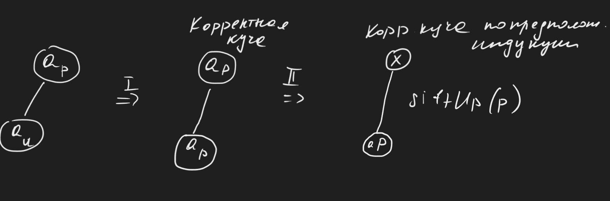
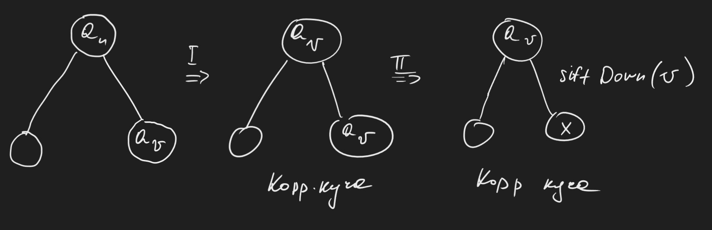
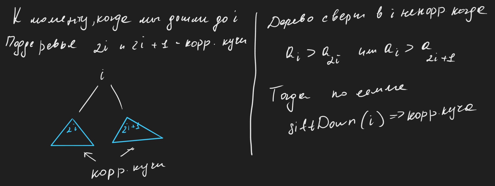
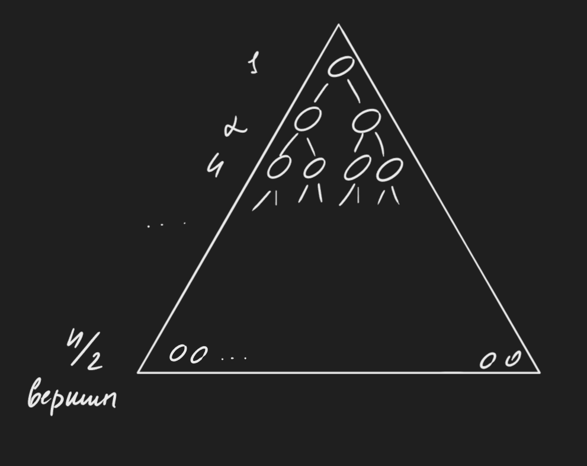
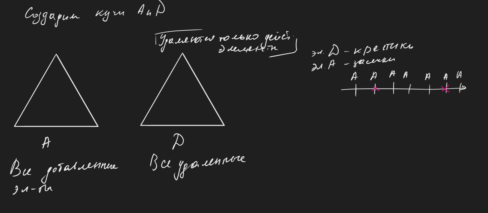

# Кучи. Сортировки на куче 

# Кучи

Куча - структура данных, которая хранить мульти-множество элементов $S$ (могут быть одинаковые) и умеет отвечать на запросы следующих типов:

* `insert x` : добавить $x$ в $S$ 
* `getMin` : найти наименьший элемент в $S$
* `extractMin` : найти и удалить наименьший элемент в $S$ 
* `decreaseKey ptr, delta >= 0 `  уменьшает на дельту какое-то конкретное $x$  по адресу `ptr` (ну сначала надо еще найти этот элемент)

---
Куча - любая структура данных, которая способна отвечать на эти операции. 
Почему это интересно? Например алгоритмы Дейкстера и Прима (на графах). Это, конечно, 100% появится в этом репозитории (если не появилась).

## Бинарная (двоичная) куча. 

Храним $S$ в массиве $a_1, a_2, ..., a_n$ 

Элементы хранятся в следующем виде:


Для этого дерева выполняется требование кучи: чем ниже продвигаемся по дереву, тем нестрого больше становятся элементы, например для этого рисунка 
$a_1\leq a_2 \leq a_4 \text{ и } a_5$ и $a_1 \leq a_3 \leq a_6 \text{ и } a_7$

Или $a_1$ нестрого меньше чем все элементы дерева, $a_2$ нестрого меньше чем все в поддереве $a_2$; $a_3$ нестрого меньше чем все элементы в его поддереве. (Элемент, записанный в каждой вершине нестрого меньше всем элементам в его поддереве) Кроме того




В таком случае в качестве ответа на `getMin` можно вернуть $a_1$ - очевидно из-за требования кучи. $O(n)$ 

---

Процедура `siftUp i`. Просеивание вверх - берем элементы и пытаетесь поднять их наверх.
Иллюстрация процедуры:


Реализация на псевдокоде: 
```cpp
siftUp(u):
	if (u == 1) return;
	p = (u/2);
	if (a[p] > a[u]):
		spaw(a[p], a[u])
		siftUp(p)
```

Симметрично можем ввести процедуру `siftDown u` 

```c++
siftDown(u): 
	if (2u > n) return; // если у вершины нету детей, мы ее не можем никуда опустить
	v = 2u;
	if (2u + 1 <= n && a[2u + 1] < a[v]):
		u = 2v + 1;
	if (a[u] > a[v]):
		swap(a[v], a[u]);
		siftDown(u);
```

Обе операции работают за логарифм, потому что глубина дерева логарифмическая (1, 2, 4, 8 и т.д. вершин)

---
Разберемся с операцией `insert x`
Добавим элемент в конец массива (в лист дерева) и починим все сломавшиеся неравенства. Возможно $x$ слишком маленький, чтобы быть "на дне", поэтому при помощи `siftUp(n)` поднимем его:

```cpp
insert(x):
	++n;
	a[n] = x;
	siftUp(n);
```

---
Разберемся с `extractMin` . Где находится минимум мы знаем (самая верхняя вершина), однако теперь нужно его еще и удалить. Сделать это можно очень легко: поменяем $a_1$ и $a_n$ местами, отрежем листик с номером $n$, после чего запустим `siftDown(1)` 

```cpp
extractMin:
	ans = a[1]
	swap(a[1], a[n]);
	--n;
	siftDown(1);
	return ans
```

---
Ну как сделать `decreaseKey u, delta` совсем очевидно:

```c++
decreaseKey(u, delta >= 0):
	a[u] -= delta;
	siftUp(u)
```

Все операции работают за $O(logn)$, потому что они сводятся к запуску `siftUp` и `siftDown`

---
<ins>Докажем корректность</ins>:

<ins> Лемма </ins> Пусть $a_1, a_2, ..., a_n$ - корректная куча. Пусть $a_u$ изменяется и становится равным $x$, тогда:

1) Если $a_u$ уменьшилось, то после `siftUp` куча вновь станет корректной.
2) Если $a_u$ увеличилось, то после `siftDown` куча станет корректной.

`insert(x)`
Если на дно кучи положить  $+\infty$ , то куча останется корректной. Если уменьшить эту бесконечность до $x$, а потом запустить `siftUp`, тогда по лемме после `siftUp` куча останется корректной.

`extractMin`
Был корень, был $a_n$. Меняем $a_n$ и $a_1$ местами  - таким образом $a_1$ увеличивается. После отрезания листа куча остается корректной. По лемме после `siftDown` куча останется корректной.

`decreaseKey` очев.

<ins> Докажем лемму </ins> 

1) Индукция по $u$ 

* База $u$ = 1
Куча остается корректной, `siftUp` ничего не делает. 

*  Переход

Пусть $a_u$ уменьшается и меняется на значение $x$, и пусть у $a_u$ есть родитель $a_p$ 
* Если $x \geq a_p$ , то ничего не сломалось. Потому что если $a_u$ было меньше своих детей, то и $x$ точно будет их меньше. `siftUp` ничего не делает.
* Если $x < a_p$ 

2) Индукция от листьев к корню (по $n - u$)

* База $u$ - лист.

После `siftDown`
Если увеличить значение в листе (вершина без детей), то никакие неравенства не нарушатся, куча будет корректной. `siftDown` ничего не делает

* Переход

Пусть $a_v$ - наименьший из детей $u$ 
* $x > a_v$
 

* если $x \leq a_v$ аналогично, никакое неравенство не сломается и `siftDown` ничего не сделает

**Лемма доказана, значит реализация корректна**

## Heap sort (сортировка кучей)

Если есть массив $a_1, a_2, ..., a_n$ . Заведем кучу, `insert` для всех элементов, потом `extract min` $n$ раз. Поэтому эта сортировка работает за $O(n \cdot logn)$ (сортировка опять же основана на сравнениях).

Не существует реализации кучи, основанной на сравнениях, в которой `insert` и `extractMin` работали бы за единицу. Как бы `insert` можно сделать за единицу, но `extractMin` не выйдет сделать быстрее, так что и то и то не выйдет за единицу. 

Зачем нужна очередная очень полезная сортировка? В `mergeSort` много доп. памяти, в `qs` нужна логарифмическая доп. память, чтобы запоминать длины отрезков. Heap sort же работает вообще без доп. памяти.

Нам потребуется процедура `heapify` - она строит корректную кучу по $n$ элементам без доп. памяти за $O(n)$ времени. 

Изначально числа лежат в массиве - давайте воспринимать его как кучу. Конечно она некорректна, но легко чинится. 
```c++
for i = n ... 1 (шаг -1): 
	siftDown(i)
```

Чем ближе ко дну, `siftDown` будет работать вообще за 1, а выше - за логарифм.

Докажем индукцией по $i$, что после вызова `siftDown i` поддерево c вершиной $i$ станет корректным.

1) База $i$ - лист. Ну очев.

2) Переход 



---
**Асимптотика.**

Будем считать, что бинарная куча полная. 


Тогда на последнем уровне `siftDown` отрабатывает за единицу (выполняется условие выхода) С предпоследнего уровня - 2 операции. Таким образом время работы пропорционально глубине вершин (расстоянию до дна).

Время работы 

$$\frac{n}{2} \cdot 1 + \frac{n}{4} \cdot 2 + \frac{n}{8} \cdot 3 + ... = \frac{n}{2} + \frac{n}{4} + \frac{n}{8} + \frac{n}{16} + ... + (\frac{n}{4} + \frac{n}{8} \cdot 2 + ...) = $$
$$= n + (\frac{n}{4} + \frac{n}{8} + \frac{n}{16}) + ... + (\frac{n}{8} + \frac{n}{16} \cdot 2 + ...)$$

Мы выносили по одному слагаемому из произведения на число для каждой дроби, пользуясь суммой геометрической прогрессии, считали выражения вида $\frac{n}{2} + \frac{n}{4} + \frac{n}{8} + ... \leq n$при $n \rightarrow +\infty$.

Таким образом, преобразовывая преобразовывая это выражение мы придем к тому что

$$n + \frac{n}{2} + \frac{n}{4} + ... \leq 2n$$
Доказали, что асимптотика правда (честно) линейная. 

---
Возвращаемся к началу раздела. `insert` всех элементов можно выполнить за $O(n)$ при помощи операции `heapify` Поэтому сортировка является $in place$. Операцию `extractMin`  можно переделать таким образом, чтобы после `swap` $a_1$ и $a_n$ лист $n$ не вырезался. Ну и выводить ничего не надо, однако в конце получится массив по не возрастанию элементов (это тоже не проблема, можно его легко перевернуть за линию). 

Не то чтобы этот алгоритм был быстрее быстрой сортировки, но по доп. памяти тут дела обстоят лучше.

## Удаление элемента из кучи.

- `erase(x)`

1) По указателю на $x$. Заменим $a_i$ на $-\infty$. После чего поднимем при помощи `siftUp` и используем `extractMin`
2) По значению. Тут уже так легко не получится, потому что нету нормального механизма "нахождения" элементу по значению. В целом нету надежды явно найти $x$ в куче.

---


Вместо удаления элемента из нашей кучи мы будем вставлять элемент в кучу $D$. Если элементы не удаляли (т.е. не добавляли в кучу $D$), то и `getMin` и `extractMin` будут работать правильно. Что-то сломается, только если из $A$ удалили минимальный элемент (На первой засечке прямой стоит крестик).  

Но это легко отследить, ведь условие того что минимум в $A$ удален проверяется тем что `A.getMin` == `D.getMin` , значит что нужно сделать `A,D.extractMin`. И так рано или поздно дойдем до элемента, который пока что не удален из $A$.

$n$ запросов $\Rightarrow$ время $O(n \cdot logn)$  
