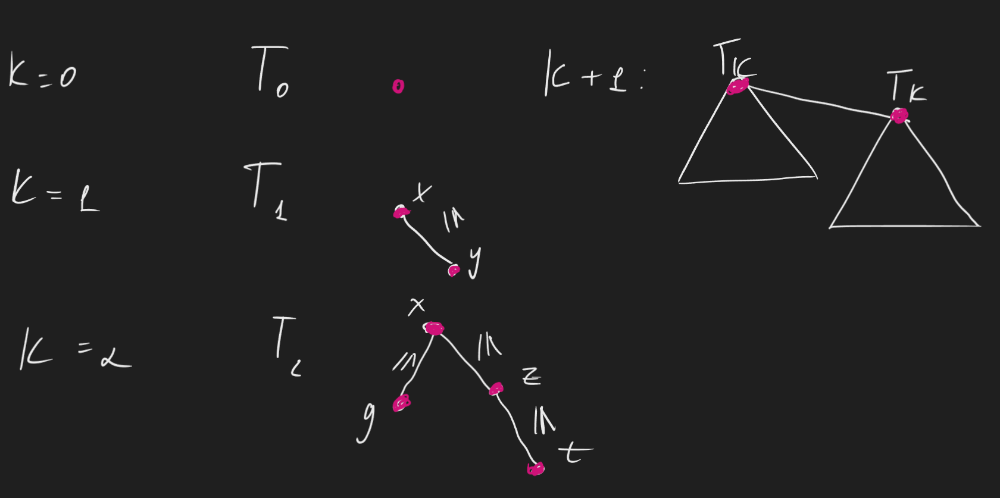
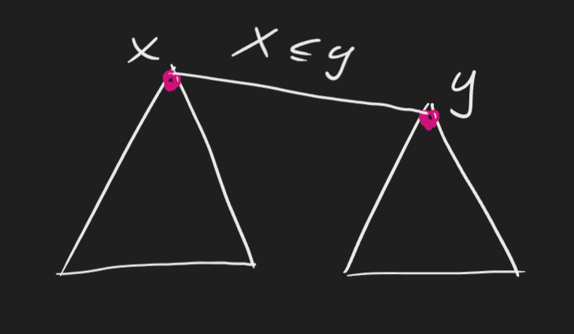
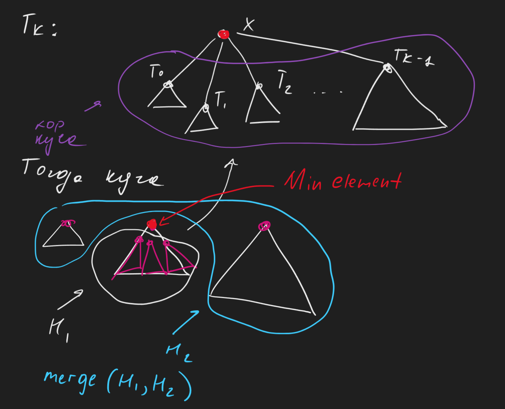
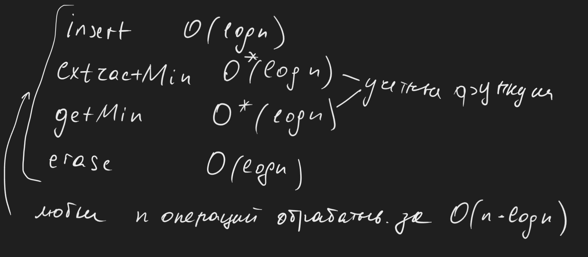
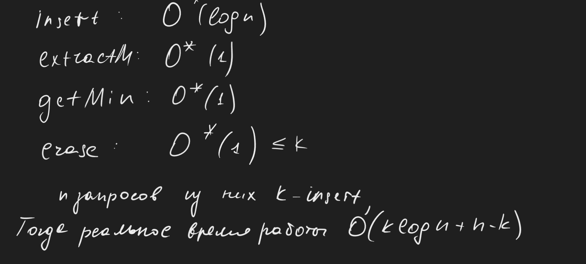
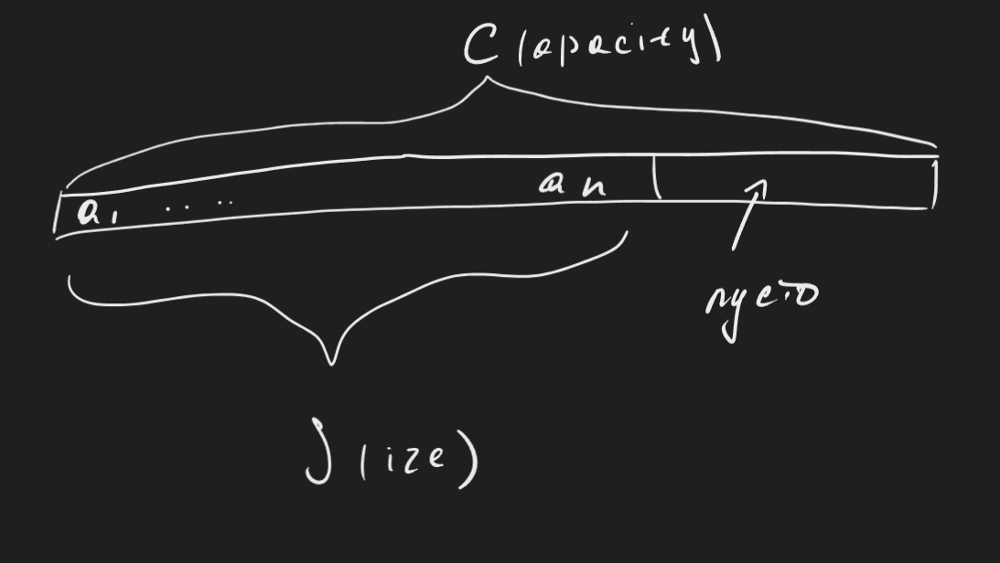
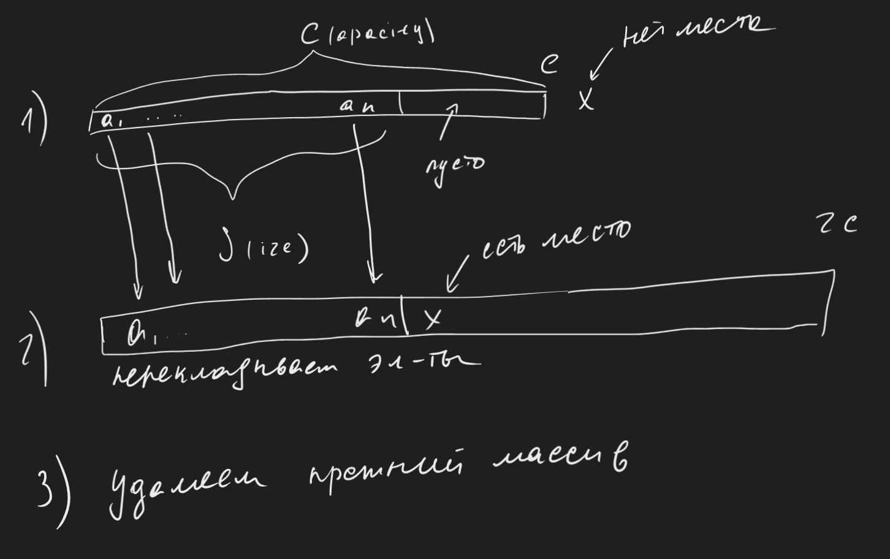
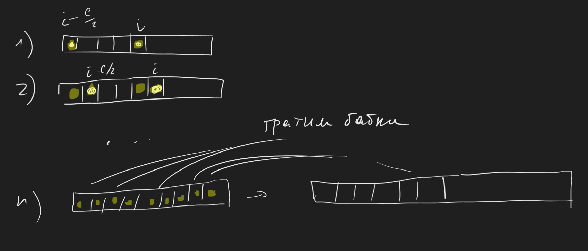

# Кучи продолжение. Динамический массив.

### Биномиальная куча

Хранит множество чисел. Основные операции над структурой:

1) `getMin`
2) `extractMin`
3) `insert x`
4) `decreaseKey ptr delta` 
5) `merge Heap1 Heap2` - отличие биномиальной кучи от двоичной. Объединяет две кучи. А самое классное что за логарифм

<ins> Опр.</ins> Биномиальное дерево ранка $k$ - это следующее дерево

Для того, чтобы получить дерево ранга $k + 1$, нужно к дереву ранга $k$ присоединить еще одно дерево ранга $k$

<ins> Опр.</ins> Биномиальная куча - набор биномиальных деревьев попарно различных рангов. Например $T_0, T_1, T_3$. 

<ins> Замечание.</ins>

1) Если в куче всего $n$ элементов, то очевидно что всего в куче $log_2 n$ деревьев, т.к в $T_k$ ровно в $2^k$ вершин
2) Набор рангов однозначно определен при фиксированном $n$. Представляем $n$ в двоичной системе счисления, таким образом разряду дерева можно сопоставить единицу. ($n = 11_{10} = 1011_{2}$ - набор $\{T_0, T_1, T_3\}$ 
3) Дерево ранга $k$ имеет глубину $k$, $k \leq log_2n$ 

В каждой вершине дерева, помимо $x$, будем хранить еще и указатели на детей (список детей). 

***
#### Операции на этой куче

1) `getMin`. 

В корне каждого дерева хранится минимальный элемент этого дерева. Но для того чтобы получать минимальный элемент кучи за $O(1)$ будем хранить указатель на корень с наименьшим значением. 

2) `merge H1 H2`

Если в этих кучах набор деревьев отличается (например $n_1$ и $n_2$ можно приставить в виде $10110$ и $1001$ соответственно), то можно просто все деревья объединить в один список (у всех деревьев разные ранги)

Если существует $T_k$ там и там, сравниваем их корни, и к меньшему подвешиваем больший.

Такая операция обеспечивает появление корректного дерева рангом $T_{k+1}$. Так нужно делать пока в следующем разряде (в нашем случае $k + 1$) не будет свободно (то есть если в соответствующих разрядах стоят единицы мы их склеиваем). Эта операция аналогична сложению в двоичной системе. Склеиваем деревья соответствующих разрядов и переносим единицу в следующий разряд. Очевидно работает за $O(logn)$ 

3) `insert x`

Заведем $T_0$, состоящая из одной вершины $x$, мерджим ее с существующим хипом и получаем корректную кучу. Ну а `merge` работает за логарифм, думайте.

4) `extractMin` 

Мы уже знаем минимальный корень (храним указатель на него). Осталось его удалить и распихать остальные вершины по другим деревьям.

5) `decreaseKey ptr delta`

Ну вообще дефолт, `siftUp`'аем этот щит и норм.

***

Для того чтобы невероятнейшим образом заботать кучу Фибоначчи, потребуется ввести Амортизационный анализ.

В чем идея? Бывают конкретные операции, которые работают долго, но суммарно их мало, поэтому в среднем выходит немного. 

<ins> Опр.</ins> Пусть $S$ - какая-то структура данных, способная обрабатывать $m$ типов запросов. Тогда функции $a_1(n), a_2(n), ..., a_m(n)$ называются учётными амортизационными асимптотиками ответов на запросы, если $\forall n, \forall$ последовательности запросов с типами $i_1, i_2, ..., i_n$ суммарное время их обработки $= O(\Sigma^{n}_{j=1} a_{ij}(n))$

<ins> Пр-ры.</ins> В бинарной куче

<ins> Зам.</ins> Можно даже считать что 

### Динамический массив (`std::vector`)

Это структура, которая хранит набор $a_1, a_2, ..., a_n$ и умеет отвечать на следующие операции:

1) Получение элемента $a_i$ по индексу $i$ - $O(1)$
2) `push_back x` добавление элемента в конец $O(1)$ амортизировано 
3) `pop_back` удаление последнего элемента $O(1)$

В памяти все выглядит очень просто - у нас выделены сколько-то ячеек в памяти, при чем какая-то часть остается незаполненной зачастую.

При наличии свободного выделенного места `push_back` работает за единицу, ведь у нас присутствует свободная память. Однако, если зарезервированная память заканчивается, приходится выделять новую, с `capacity` в два раза больше старой, копируем элементы и очищаем память старого массива.

Утверждается, что время работы `push_back` равняется $O^*(1)$ 

Однако бывает что массив очень большой вместимости (неприлично большой), тогда после `pop_back` если $S < \frac{1}{4} \cdot C$ будем пере выделять массив вдвое меньше. Ну в таком случае `pop_back` работает за $O^*(1)$  

<ins> Утв.</ins> `push_back` и `pop_back` работают за $O^*(1)$  

<ins> Док-во.</ins>

Метод монеток (метод бухгалтерского учёта)

Когда приходит какая-то легкая операция, можно работать немного медленнее, подкопить монетки (отложить на будущее на счет в банке). Когда приходит тяжелая операция, достаем монетки, которые одолжили себе на будущее. 

Пусть когда приходит "легкий" `push_back`, будем класть по 10 монеток на элементы с индексами $i$ и $i - \frac{c}{2}$. Когда приходит легкий `pop_back`, только кладем по 10 монет на позиции $i$ и $i - \frac{c}{4}$ 

Пусть приходит теперь "тяжелый" `push_back`. К этому моменту на каждом элементе будет лежать по 10 монет. Время тяжелой операции $4 \cdot C$ монеток, однако у нас уже к тому необходимому моменту расширения будет $10 \cdot C$ монеток

Аналогично работает с `pop_back`

