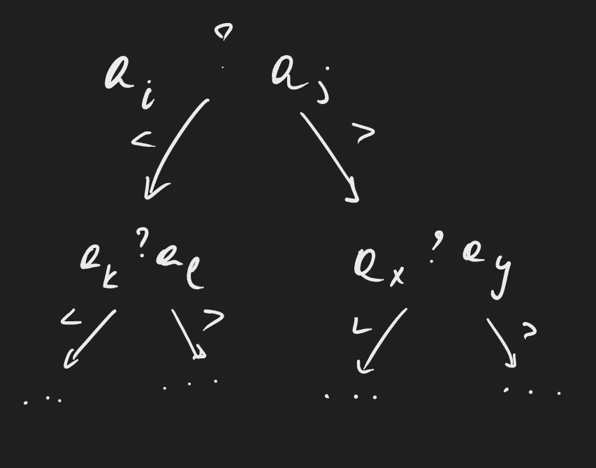
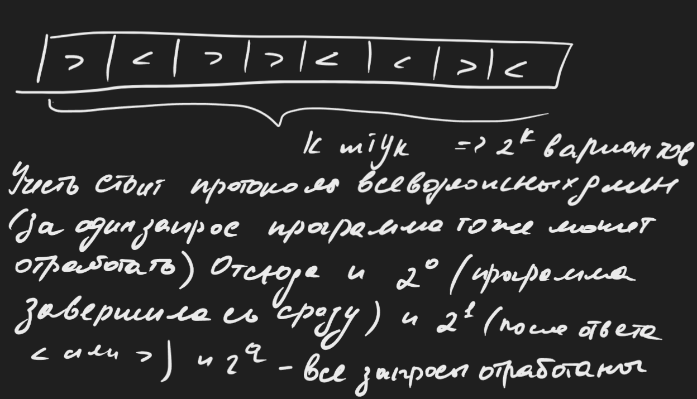
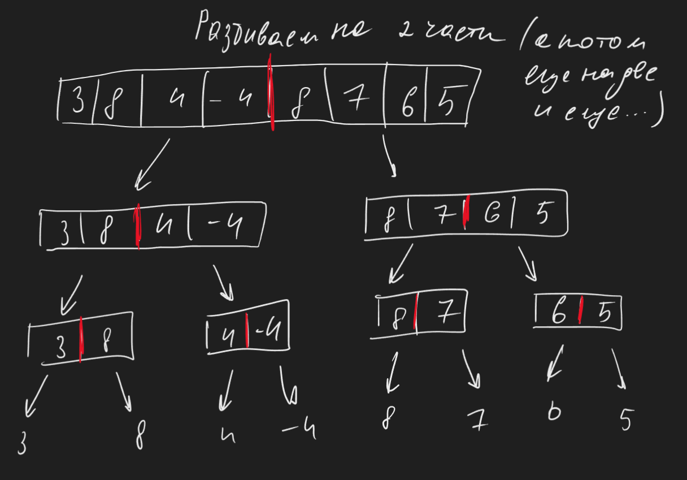
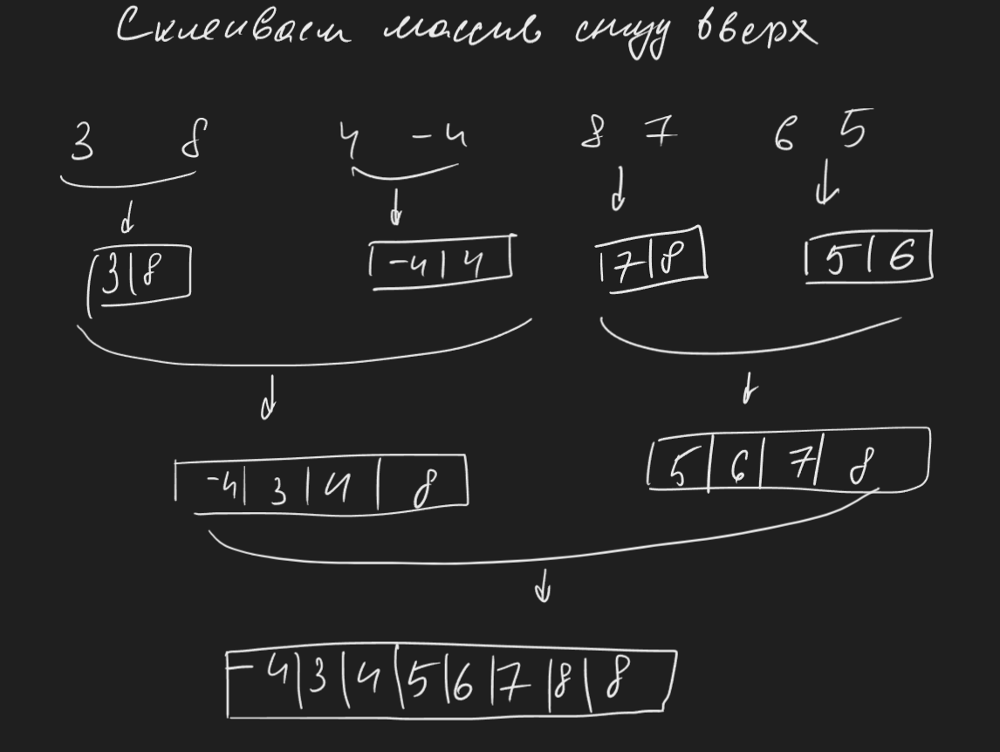
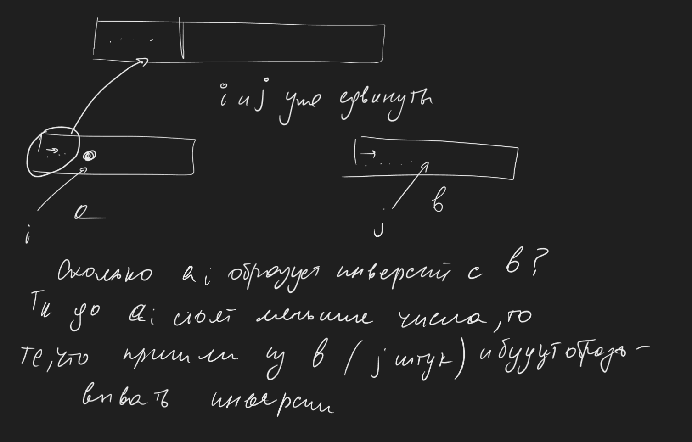
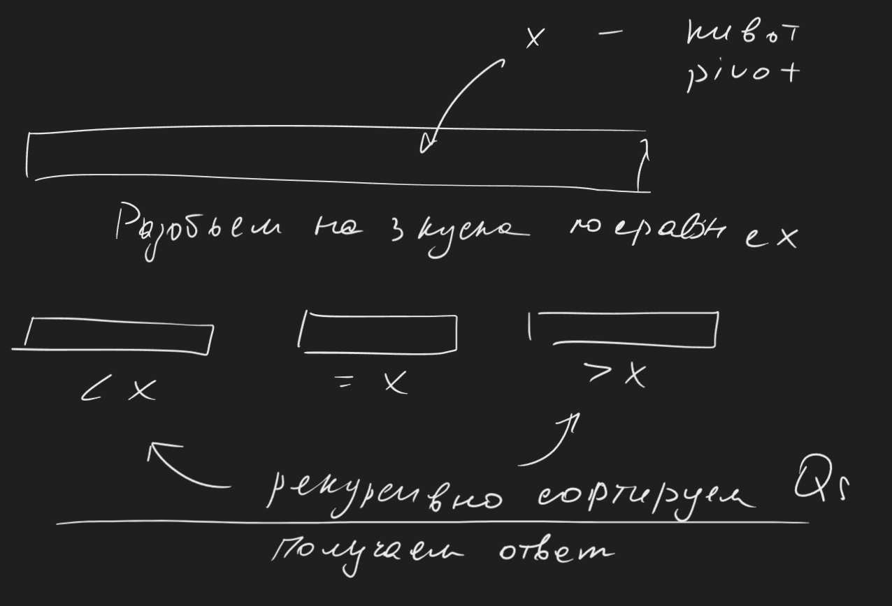

## Сортировки. Введение. Нижняя граница асимптотики
Задача: $a_1, a_2, ..., a_n$ - дано
Найти $b_1 \leq b_2 \leq ...\leq b_n$ 
Наборы $a_1 ... a_n$ и $b_1, ..., b_n$ отличаются только порядком элементов. Эти объекты находятся в некотором универсуме $X$ и их возможно сравнить.
***
**Теорема** о нижней оценки на алгоритм сортировки сравнениями.
Если алгоритм может только сравнивать элементы, то время сортировки массива длины $n$ есть $\Omega(n \cdot logn)$ 

**Док-во**.
$a_1, a_2, ..., a_n$ - попарно различны
Алгоритм может спрашивать $a_i ? a_j$ и в зависимости от ответа на вопрос выполняет условия. Следовательно он устроен как решающее дерево.

В конце выдает корректную перестановку $\sigma$ индексов массива. Результат работы алгоритма зависит от $n$ и от последовательности получаемых ответов $(<, >)$
Пусть алгоритм всегда совершает $\leq q$ запросов $(a_1 ? a_j$). Тогда есть не больше $$2^0 + 2^1 + 2^2 + ... +2^q \leq 2^{q + 1}$$ возможных протоколов работы алгоритма

Однако нужно чтобы таких протоколов было хотя бы $n!$ Потому что все $\sigma$ достижимы (исходный массив может быть как угодно перемешан, должна существовать хотя бы одна ветка для каждой перестановки). Отсюда $$n! \leq 2^{q + 1}$$ Отсюда хотелось бы доказать что (оценить снизу) $$q = \Omega(n \cdot logn)$$
Докажем вспомогательную лемму $$log(n!) = \Theta (n \cdot logn)$$
В одну сторону$$n! = 1 \cdot 2 \cdot ... \cdot n \leq n^n$$
$$log_2(n!) \leq n \cdot log_2n \Rightarrow log(n!) = O(n \cdot logn)$$
В другую $$\displaystyle n! = 1 \cdot 2 \cdot 3 \cdot ... \cdot \lceil \frac{n}{2} \rceil \cdot ... \cdot n \geq \lceil \frac{n}{2} \rceil \cdot (\lceil \frac{n}{2} \rceil + 1) \cdot ... \cdot n \geq \lceil \frac{n}{2} \rceil ^ {n - \lceil \frac{n}{2} \rceil + 1}$$*Если* $n = 2k$ $\Rightarrow n! \geq k(k+1) \cdot ... \cdot 2k \leq k^{k + 1} \Rightarrow log(n!) \geq log(k^{k+1}) = (k + 1) logk \geq \frac{n}{2} log\frac{n}{2} =$
$= \frac{1}{2}n \cdot (logn - 1) = \frac{1}{2}logn - \frac{1}{2}n$
*Если* $n = 2k + 1 \Rightarrow n! \geq (k + 1)(k + 2)(k + 3) \cdot ... \cdot (2k + 1) \geq (k + 1)^{k + 1} \Rightarrow$
$log(n!) \geq (k +1)log(k+1) \geq \frac{n}{2} log(\frac{n}{2})$

Значит в любом случае $log(n!) \geq \frac{1}{2}n \cdot logn - \frac{1}{2} n = \Omega(n \cdot logn)$
Доказали вспомогательную, возвращаемся, и видим что $$n! \leq 2^{q + 1} \Rightarrow log(n!) \leq q + 1$$ Мы доказали что $q = \Omega(log(n!))$, а так как $log(n!) = \Theta(n \cdot logn)$ то $q = \Omega(n \cdot logn)$
***
Мораль - быстрее чем за $O(n \cdot logn)$ алгоритм сортировки, построенный на сравнении построить нельзя
## Merge sort

Иллюстрация к алгоритму: 
* Разбиение

* Слияние (Начиная с конца параллельно проходимся по двум концам массивов, сравнивая элементы и вставляя наименьший из них, сдвигаем индекс)

В общем виде алгоритм сортировки слиянием работает таким образом: 
* Большой массив разбивается на два кусочка примерно одинаковой длины
* Рекурсивно сортируем эти половинки
* Склеиваем половинки в одну
***
Реализация (при помощи псевдокода):
Процедура `merge`
```c++
Merge(a[0 ... n-1], b[0 ... m-1], to [0 ... n + m - 1]):
i = 0; j = 0;
while (i < n || j < m) {
	if (j == m || (i < n && a[i] =< b[j])) {
		to[i + j] = a[i]; i++
	} else {
		to[i + j] = b[j]; j++
	}
}

```
Основная функция:
```c++
MergeSort(a[0 ... n-1]):
	if (n <= 1) return;Ы
	k = int(n / 2);
	l = [a0, a1, ... , ak-1];
	r = [ak, ak+1, ..., an-1];
	MergeSort(l);
	MergeSort(r);
	Merge(l, r, a)
```
Докажем корректность по индукции:
* база $n = 1$ очевидна
* иначе разбираем массивы на два куска, по индукции на них merge сорт работает корректно
* используем то, что они уже отсортированы, значит `merge` корректно сольет их в один большой кусок
Асимптотика:
Если обозначить через $T(n)$ то $$T(n) = 2 \cdot T(\frac{n}{2}) + O(n) = O(n \cdot logn)$$
В $O(n)$ входит создание массивов, время работы `merge` $O(m + n)$ (параллельно проходится по массивам)
Этот алгоритм работает за минимально теоретически возможное время.

Упр. 1) Сделать доп. память $O(n)$
Упр. 2) Убрать рекурсию из алгоритма

#### ___Задача о числе инверсий в массиве___

Инверсия - $(i; j) : i < j, a_i > a_j$
Есть массив длины $n$. Разбиваем массив на два кусочка и считаем число инверсий в правой и левой части (не учитывая инверсии между двумя половинками, их учтем потом). Половинки можно отсортировать, потому что число инверсий пересекающих разрез не изменится ($i$ и $j$ находятся в разных половинах)

Делается это добавлением всего одной строчки в алгоритм. 
```c++
Merge(a[0 ... n-1], b[0 ... m-1], to [0 ... n + m - 1]):
i = 0; j = 0;
while (i < n || j < m) {
	if (j == m || (i < n && a[i] =< b[j])) {
		to[i + j] = a[i]; i++; ans+=j;
	} else {
		to[i + j] = b[j]; j++
	}
}


```
Пусть за количество рекурсий отвечает переменная `ans`. Такое решение будет корректным потому что:

По итогу задача была решена за  $O(n \cdot logn)$ добавлением одной строчки

## Quick sort (сортировка Хоара)
На практике используется чаще, не использует много памяти, но к сожалению, зависит от вероятности. В канонической реализации x - случайный элемент массива.
Иллюстрация:

**Реализация на псевдокоде** 
```c++
Partition(a[0 ... n-1], x):
	B : все элементы < x
	C : все элементы = x
	D : все элементы > x
	возвращаем длины |A|, |B|, |C|

```

```c++
QuickSort(a[0 ... n-1]):
	if(n <= 1) return;
	x = a[random(0, n - 1)];
	l, m, r = Partition(a, x);
	QuickSort(a[0 ... l-1]);
	QuickSort(a[l + m ... n - 1]);
```

**Теорема**
В среднем асимптотика есть $O(n \cdot logn)$ Мат. ожидание. бла бла бла очень сложно, поэтому без доказательства. (Теории вероятности строгой у меня еще не было)
## Quick Select
**Опр**. Пусть есть массив $a_1, a_2, ..., a_n$ 
$k$-aя порядковая статистика - элемент на $k$-ом месте после сортировки. - $a_{(k)}$
Можно конечно просто отсортировать массив в лучшем случае за $O(n \cdot logn)$ и вывести эту $k$-ую статистику, но возможно это сделать и побыстрее.

**Задача.** За быстро найти $k$-ую порядковую статистику.
Посплитим массив как в `Qs` на 3 части. Если $k \leq |B|$ , то значит что после сортировки $k$ будет где-то в $B$. Если $|B| < k \leq |B| + |C|$ то ответ $x$, если $k > |B| + |C|$, то ответ приходит из куска $B$. В таком случае можно запустить `Qs` только на одном куске (или не запускать вовсе в случае $|B| < k \leq |B| + |C|$ )

**Псеводреализация:**
```c++
QuickSelect(a[1 ... n], k):
	if(n==1) return a[1];
	l, m, r = Partition(a, a[random(0, n - 1)]);
	if (k =< l) return QuickSelect(a1 ... al, k);
	if (k <= l + m) return x;
	return QuickSelect(al+m+1 .. an, k - l - m)
```

***
*На запись лекции ушло 3 часа 20 минут*